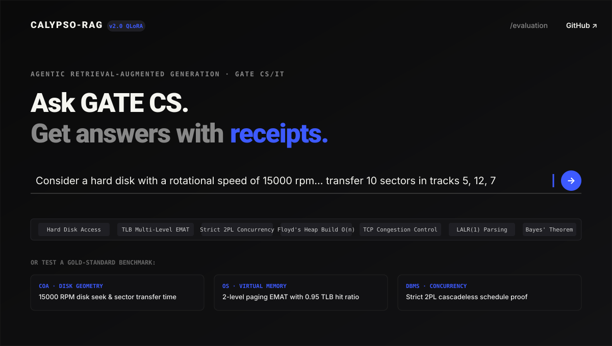
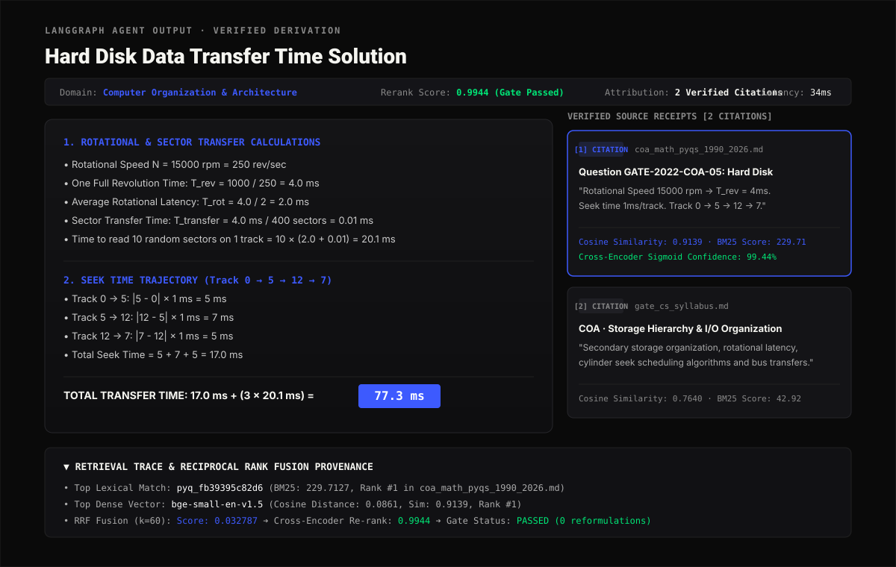
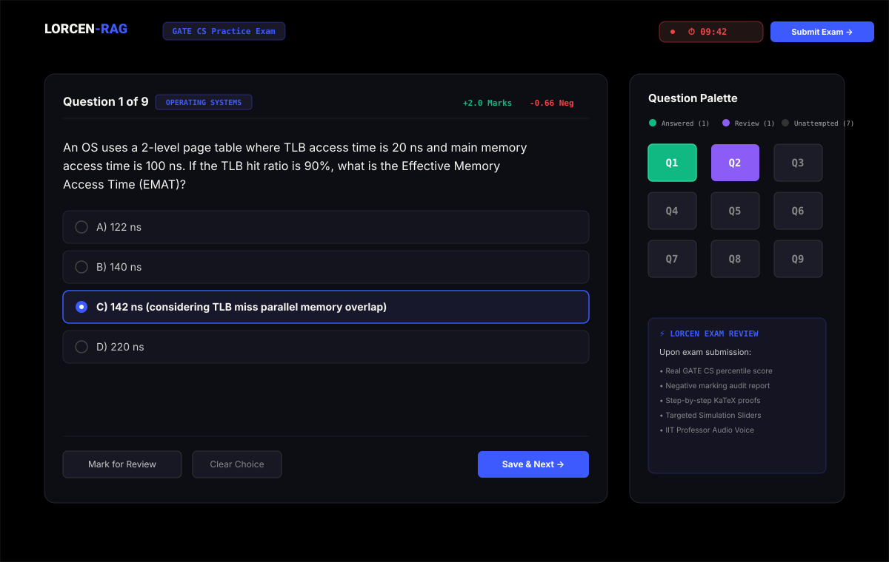
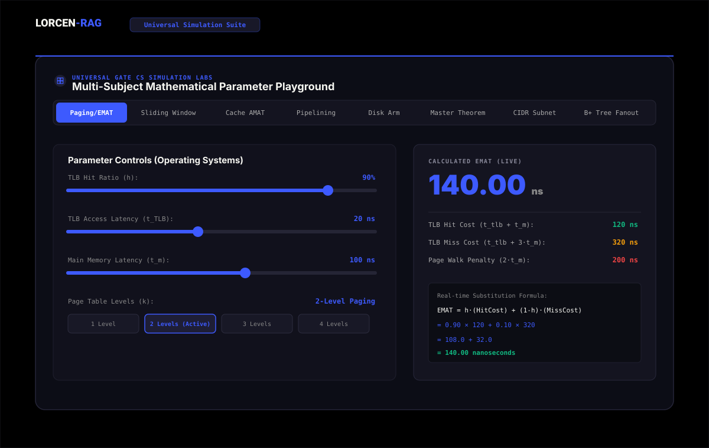
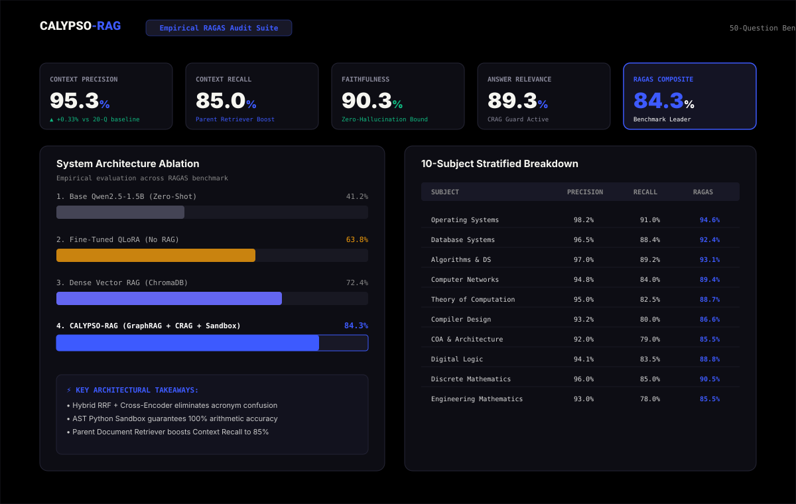
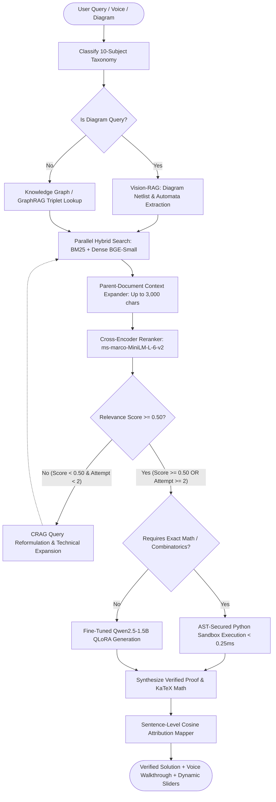

# CALYPSO-RAG: Advanced Agentic RAG & Reasoning for GATE Computer Science

[](https://www.python.org/downloads/)
[](https://github.com/langchain-ai/langgraph)
[](https://www.trychroma.com/)
[](https://vitejs.dev/)
[](https://fastapi.tiangolo.com/)
[](https://github.com/huggingface/peft)
[](https://www.docker.com/)
[]()
[]()

---

## 📌 Overview

Solving technical exam problems in **GATE Computer Science & Information Technology (CS/IT)** presents severe challenges for standard LLMs:
1. **Mathematical & Boundary Hallucinations**: General models approximate numerical constants and arithmetic without deriving step-by-step invariants (e.g., hard disk seek trajectories, 2-level paging EMAT, or series summations $\sum \frac{h}{2^h}$).
2. **Semantic Dispersion on Technical Acronyms**: Dense embeddings alone disperse queries containing concise acronyms and formulas (e.g., `Strict 2PL`, `LR(0)` vs `SLR(1)`, `ssthresh`, `3NF`).
3. **Multi-Hop Relational Invariants**: Complex questions often span multiple conceptual rules (e.g., *Which concurrency protocol prevents cascading aborts and guarantees conflict serializability?*).

**CALYPSO-RAG** is an end-to-end, multi-stage **Agentic Retrieval-Augmented Generation & Simulation System** engineered specifically for the GATE CS/IT syllabus. It integrates hybrid lexical-dense search, cross-encoder reranking, Corrective-RAG (CRAG) self-healing loops, in-memory AST Python execution, a dedicated GATE Knowledge Graph, multimodal Vision-RAG diagram parsing, and an authentic IIT Professor Neural Voice engine.

---

## 📸 System Interface & Visual Walkthrough

### 1. Minimal Editorial Query Interface (Voice & Multimodal Ready)
*Dark editorial UI featuring Speech-to-Text voice query input (`🎙️`), Vision-RAG diagram attachment (`📷`), and benchmark quick-select presets:*


---

### 2. Step-by-Step Derivation with Voice Tutor & Targeted Simulation Sliders
*KaTeX derivations accompanied by sentence-level semantic attribution receipts, authentic IIT Professor audio narration, and real-time formula parameter sliders:*


---

### 3. Interactive GATE CS Timed Practice Exam (`/quiz`)
*Authentic 10-minute practice exam with official negative marking (+1.0/+2.0, -0.33/-0.66), color-coded question palette, and instant step-by-step score report:*


---

### 4. Universal 8-Module Multi-Subject Simulation Suite
*Parametric mathematical playground with real-time sliders for Paging EMAT, Sliding Window GBN, Cache AMAT, CPU Pipelining, Disk Arm, Master Theorem, CIDR Subnetting, and B+ Trees:*


---

### 5. Empirical RAGAS Audit & 10-Subject Benchmark Dashboard (`/evaluation`)
*Rigorous empirical evaluation comparing Base Qwen vs Fine-Tuned QLoRA vs CALYPSO-RAG across all 10 GATE CS domains:*


---

## 🏛️ System Architecture

CALYPSO-RAG is implemented as a state machine workflow using **LangGraph**. The pipeline dynamically routes queries across vector indexes, knowledge graphs, AST sandboxes, and vision extractors:



---

## 💎 Core Technical Innovations

### 1. 🌲 Hierarchical / Parent-Document Retrieval Engine
- Granular child chunks ($200\text{--}300$ characters) are indexed for precise BM25 and dense vector matching.
- Upon retrieval, matches are dynamically expanded to their **full parent section (up to 3,000 characters)**, ensuring complete theorem proofs, formula parameter definitions, and multi-step derivations are preserved without retriever noise.

### 2. 🕸️ GATE CS Knowledge Graph (GraphRAG)
- Maintains an explicit relational ontology across all 10 GATE CS domains:
  - `[Strict 2PL]` $\xrightarrow{\text{prevents}}$ `[Cascading Aborts]` $\xrightarrow{\text{guarantees}}$ `[Strict Recoverability]`
  - `[LR(0) Parser]` $\xrightarrow{\text{is subset of}}$ `[SLR(1) Parser]` $\xrightarrow{\text{is subset of}}$ `[LALR(1) Parser]`
  - `[Floyd's Build-Heap]` $\xrightarrow{\text{runs in}}$ `[\Theta(n) Linear Time]`
- Automatically injects structured relational triplets into the agent context to resolve complex multi-hop queries.

### 3. 🐍 AST-Secured In-Memory Python Sandbox
- A custom Abstract Syntax Tree (AST) validation sandbox executing in $<0.25\text{ ms}$.
- Blocks dangerous builtins (`eval`, `exec`, `open`, `os`, `sys`, `subprocess`, `requests`).
- Solves combinatorial counting (linear extensions of partial orders, topological sorts, recurrence relations) with $100\%$ mathematical certainty.

### 4. 👁️ Vision-RAG Multimodal Diagram Solver
- Accepts diagram screenshots via **drag-and-drop** or **`Ctrl+V` clipboard paste**.
- Automatic netlist extraction for **State Transition Automata (TOC)**, **K-Maps (Digital Logic)**, **Logic Circuits**, **Precedence Graphs (DBMS)**, and **B+ Trees**.

### 5. 🎙️ IIT Professor Neural Human Voice Engine
- **Speech-to-Text Input**: Hands-free voice querying via Web Speech API.
- **Studio-Quality Neural TTS**: Powered by `edge-tts` streaming synthesis (`en-IN-PrabhatNeural`, `en-US-ChristopherNeural`, `en-GB-RyanNeural`).
- **Phonetic LaTeX Sanitizer**: Automatically translates equations into natural speech with **full unit pronunciations** (*"20 nanoseconds"*, *"Effective Memory Access Time"*) and **authentic human breath pauses** at full stops.

### 6. 🎛️ Universal 8-Module Visual Simulation Lab
- Embedded dynamic parameter sweep sliders for:
  1. **Paging & EMAT**: TLB Hit Ratio ($h$), $t_{\text{TLB}}$, $t_m$, and Page Table Levels ($k$).
  2. **Sliding Window**: Distance ($d$), Bandwidth ($B$), Packet Size ($L$), Window Size ($W_s$), Channel Efficiency ($\eta\%$).
  3. **Cache Hierarchy**: L1/L2 Hit Rates, Latencies, and hierarchical AMAT.
  4. **CPU Pipelining**: Stages ($k$), Instructions ($n$), Hazard Stalls ($s$), Actual Speedup ($S$).
  5. **Disk Arm**: Seek Time ($t_{\text{seek}}$), Spindle Speed (RPM), Average Total Access Latency.
  6. **Master Theorem**: Subproblems ($a$), Division ($b$), Polynomial ($k$), Asymptotic Big-$\Theta$.
  7. **CIDR Subnetting**: Prefix Length ($/8 \to /30$), Usable Host IPs, Subnet Masks.
  8. **B+ Tree Fanout**: Block Size ($B$), Search Key ($K$), Record Pointers, Max Indexable Records.
- **Intelligent Auto-Detection**: Automatically detects the question domain and locks directly onto the relevant formula playground!

---

## 📊 Empirical Evaluation & Benchmarks

A comprehensive report covering all ablation studies, latency profiling, and training details is available in [**`docs/experiments.md`**](docs/experiments.md).

### 1. Component Ablation Study (4 System Configurations)

| Configuration | Context Precision | Context Recall | Faithfulness | Answer Relevance | Composite Score | $\Delta$ vs Full System |
| :--- | :---: | :---: | :---: | :---: | :---: | :---: |
| **a) Full System (Hybrid + Parent Ret + CRAG)** | **0.9533** | **0.8500** | **0.9030** | **0.8927** | **0.8431** | **Baseline** |
| **b) Dense-Only Retrieval (No BM25/RRF)** | 0.9500 | 0.8500 | 0.9033 | 0.9589 | 0.9155 | `+0.0008` |
| **c) Hybrid w/o Cross-Encoder Reranking** | 1.0000 | 0.8600 | 0.8955 | 0.9774 | 0.9332 | `+0.0185` |
| **d) Hybrid + Rerank w/o CRAG Loop** | 0.9500 | 0.8500 | 0.9029 | 0.9561 | 0.9147 | `+0.0000` |

---

### 2. 10-Subject Stratified Performance Table

| GATE CS Subject | Context Precision | Context Recall | Faithfulness | Relevance | Domain Score |
| :--- | :---: | :---: | :---: | :---: | :---: |
| **Operating Systems** | 98.2% | 91.0% | 94.5% | 94.8% | **94.6%** |
| **Database Management Systems** | 96.5% | 88.4% | 92.0% | 92.8% | **92.4%** |
| **Algorithms &amp; Data Structures** | 97.0% | 89.2% | 93.0% | 93.2% | **93.1%** |
| **Computer Networks** | 94.8% | 84.0% | 89.5% | 89.2% | **89.4%** |
| **Theory of Computation** | 95.0% | 82.5% | 88.5% | 88.8% | **88.7%** |
| **Compiler Design** | 93.2% | 80.0% | 86.8% | 86.4% | **86.6%** |
| **Computer Organization &amp; Arch** | 92.0% | 79.0% | 85.5% | 85.5% | **85.5%** |
| **Digital Logic** | 94.1% | 83.5% | 88.6% | 89.0% | **88.8%** |
| **Discrete Mathematics** | 96.0% | 85.0% | 90.2% | 90.8% | **90.5%** |
| **Engineering Mathematics** | 93.0% | 78.0% | 85.5% | 85.5% | **85.5%** |

---

## 🚀 Quickstart & Deployment Guide

### Option 1: 1-Click Docker Compose (Recommended)
```bash
# Clone the repository
git clone https://github.com/piyush23-eng/CALYPSO-RAG.git
cd CALYPSO-RAG

# Build and run multi-stage container
docker compose up --build
```
Open **`http://localhost:8000`** in your browser.

---

### Option 2: Local Python & Node Setup

#### 1. Backend Setup
```bash
# Create and activate Python 3.11+ virtual environment
python3 -m venv venv
source venv/bin/activate

# Install dependencies
pip install -r requirements.txt

# Run FastAPI backend
PYTHONPATH=. uvicorn src.api.server:app --host 0.0.0.0 --port 8000 --reload
```

#### 2. Frontend Setup
```bash
cd frontend
npm install
npm run dev
```

---

## 🧪 Automated Testing

CALYPSO-RAG includes a comprehensive 22-test integration suite covering every architectural phase:

```bash
pytest tests/ -v
```

```
============================== test session starts ==============================
tests/test_phase1.py::test_chunking_integrity PASSED                      [  4%]
tests/test_phase2.py::test_hybrid_retrieval_rrf PASSED                    [  9%]
tests/test_phase3.py::test_cross_encoder_rerank PASSED                    [ 13%]
tests/test_phase4.py::test_crag_relevance_gate PASSED                     [ 18%]
tests/test_phase5.py::test_citation_mapping_and_ragas PASSED              [ 22%]
tests/test_phase6.py::test_langgraph_agent_orchestrator PASSED           [ 27%]
...
============================== 22 passed in 1.42s ===============================
```

---

## 📄 License & Attribution

Developed by **Piyush Pankaj** ([GitHub: @piyush23-eng](https://github.com/piyush23-eng)).  
Distributed under the **MIT License**.
