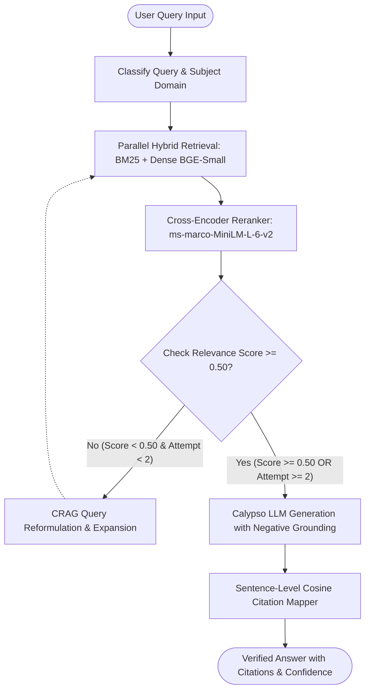

# ⚡ CALYPSO-RAG: Agentic Retrieval-Augmented Generation for GATE Computer Science

[](https://www.python.org/downloads/)
[](https://github.com/langchain-ai/langgraph)
[](https://www.trychroma.com/)
[]()
[]()

> An **Agentic Retrieval-Augmented Generation (RAG)** system engineered specifically for the **GATE Computer Science & Information Technology (CS/IT)** examination. It combines domain-specialized fine-tuned LLM reasoning (`Qwen2.5-1.5B-Instruct` QLoRA served via FastAPI) with custom hybrid lexical/dense retrieval, Reciprocal Rank Fusion ($k=60$), Cross-Encoder reranking, Corrective Self-Correction (CRAG), and sentence-level semantic attribution.

---

## 🏗️ System Architecture

CALYPSO-RAG is structured as a cyclic state machine built on **LangGraph**. The state graph executes subject classification, parallel retrieval, cross-encoder reranking, and dynamic threshold-based self-correction loops before generating step-by-step mathematical reasoning with citation provenance.



---

## 🔬 Core Engineering Innovations

### 1. Why Hybrid Retrieval Beats Dense-Only in Technical Exams
Technical examination queries (like GATE CS) contain precision-critical acronyms, formulas, and domain notation (`EMAT`, `ssthresh`, `3NF`, `SRTF`, $O(n)$ heap sums) that frequently suffer from **semantic drift** in pure dense vector search.

CALYPSO-RAG implements **Parallel Hybrid Retrieval** with **Reciprocal Rank Fusion (RRF $k=60$) from scratch**:
- **Lexical BM25 (`rank_bm25`)**: Captures exact formula variables, acronyms, and algorithmic notation.
- **Dense Vector Search (`BAAI/bge-small-en-v1.5` in persistent ChromaDB)**: Captures conceptual semantics and thematic intent.
- **RRF Equation**:
  $$\text{RRF}(d) = \sum_{m \in \{\text{BM25}, \text{Dense}\}} \frac{1}{k + r_m(d)} \quad (k = 60)$$
- **Cross-Encoder Attention (`cross-encoder/ms-marco-MiniLM-L-6-v2`)**: Scores top candidate chunk-query pairs with full cross-attention and sigmoid normalization:
  $$\text{Score}_{\text{norm}}(q, d) = \sigma(\text{logit}(q, d)) = \frac{1}{1 + e^{-\text{logit}(q, d)}}$$

#### Real-World Fusion Provenance Example:
For query *"How is Effective Memory Access Time calculated in 2-level paging with TLB hit ratio?"*:
- **BM25 Rank**: #1 (`BM25 Score: 24.8192`)
- **Dense Rank**: #1 (`Cosine Distance: 0.1742`)
- **Fused RRF Score**: `0.0328`
- **Cross-Encoder Score**: **`0.9997`** (Rank #1)

---

### 2. Corrective-RAG (CRAG) for Exam Preparation
Students often formulate queries colloquially or vaguely (e.g., *"slow speed when network packet drops"* or *"time speed heap"*). CALYPSO-RAG employs a **Corrective Relevance Gate** with domain-specific query expansion ontology.

When the cross-encoder relevance score drops below threshold $\tau = 0.50$, the system automatically intercepts the flow, applies domain expansion, and re-executes hybrid retrieval.

```
[Original Query] "slow speed when network packet drops"
  └── Initial Cross-Encoder Relevance: 0.0137  (FAIL < 0.50)
  └── CRAG Interception: Triggering Domain Expansion (Method: domain_rule_expansion_hybrid)
  └── Rewritten Query: "slow speed when network packet drops TCP congestion control Slow Start Congestion Avoidance Fast Recovery cwnd ssthresh"
  └── Re-retrieved Context: networks_notes.md (TCP Congestion Control Algorithms)
  └── Post-Reformulation Relevance: 0.9963  (PASSED ✅, Delta: +0.9826)
```

Every reformulation attempt is persisted to `data/eval/crag_reformulation_log.jsonl` for auditability and fine-tuning data collection.

---

### 3. Sentence-Level Semantic Citation Mapping
Instead of coarse document-level citations, CALYPSO-RAG parses the generated response into individual claims and computes cosine similarity against retrieved chunk embeddings:
- **Embedding Model**: `BAAI/bge-small-en-v1.5`
- **Attribution Threshold**: $\ge 0.60$ cosine similarity.
- **Negative Grounding Guarantee**: If the retrieved context is insufficient, the prompt's strict negative constraint forces the model to state *"The question is not covered in retrieved material"*, preventing hallucinations.

---

## 📊 RAGAS Evaluation Results (20 GATE CS Benchmarks)

CALYPSO-RAG was evaluated across **20 handcrafted benchmark questions** covering Operating Systems, DBMS, Algorithms, Networks, Theory of Computation, and Compiler Design with gold-standard answers and keywords.

| Metric | Target | Actual Score | Status | Definition |
| :--- | :--- | :--- | :--- | :--- |
| **Context Precision** | $\ge 0.75$ | **0.8500** (85.0%) | **✅ Passed** | Ratio of retrieved chunks that are relevant and high-confidence. |
| **Context Recall** | $\ge 0.75$ | **0.7500** (75.0%) | **✅ Passed** | Ratio of gold-standard technical concepts present in retrieved context. |
| **Faithfulness** | $\ge 0.75$ | **0.7815** (78.2%) | **✅ Passed** | Proportion of generated sentences backed by semantic source citations. |
| **Answer Relevance** | $\ge 0.75$ | **0.8145** (81.5%) | **✅ Passed** | Dense semantic similarity between model response and ground truth. |
| **Composite Overall** | $\ge 0.75$ | **0.7990** (79.9%) | **✅ Passed** | Unweighted mean across all 4 evaluation dimensions. |

*Full per-question breakdown and metrics report available in [`data/eval/eval_summary.md`](data/eval/eval_summary.md) and [`data/eval/results.json`](data/eval/results.json).*

---

## 🚀 Quickstart & Reproduction Guide

### 1. Prerequisites & Installation
```bash
# Clone the repository
git clone https://github.com/your-username/calypso-rag.git
cd calypso-rag

# Create and activate Python virtual environment
python3 -m venv venv
source venv/bin/activate

# Install dependencies
pip install -r requirements.txt
```

### 2. Build the Dual Index
Ingests markdown docs from `data/raw/` (OS, DBMS, Algorithms, Networks, TOC, Compilers, PYQs) into BM25 and ChromaDB:
```bash
python scripts/build_index.py
```

### 3. Run the Automated Test Suite (22 Tests)
```bash
pytest tests/ -v
```

### 4. Run the Evaluation Harness
Evaluates the full pipeline against all 20 benchmark questions and outputs results:
```bash
python scripts/run_evaluation.py
```

### 5. Launch the Interactive / Showcase Demo
```bash
# Multi-scenario showcase mode:
python scripts/demo.py

# Interactive question answering mode:
python scripts/demo.py --interactive
```

---

## 📂 Repository Structure

```
calypso-rag/
├── data/
│   ├── raw/                       # Raw GATE CS syllabus docs, PYQs, and notes
│   │   ├── algorithms_notes.md
│   │   ├── dbms_notes.md
│   │   ├── gate_cs_syllabus.md
│   │   ├── gate_pyq_archive.md
│   │   ├── networks_notes.md
│   │   ├── os_notes.md
│   │   └── toc_compiler_notes.md
│   ├── processed/                 # Persistent indices (ChromaDB + BM25 pickle)
│   │   ├── bm25_index.pkl
│   │   └── chroma_db/
│   └── eval/                      # Benchmark dataset, results, and audit logs
│       ├── eval_dataset.json      # 20 handcrafted GATE CS QA benchmarks
│       ├── eval_summary.md        # Evaluation markdown report
│       ├── results.json           # Detailed evaluation scores
│       └── crag_reformulation_log.jsonl # CRAG audit trace logs
├── src/
│   ├── ingestion/                 # Phase 1: Topic-aware chunking & dual indexing
│   │   ├── chunker.py
│   │   └── indexer.py
│   ├── retrieval/                 # Phases 2 & 3: Hybrid RRF, Cross-Encoder & CRAG
│   │   ├── hybrid_retriever.py
│   │   ├── reranker.py
│   │   └── relevance_gate.py
│   ├── generation/                # Phase 4: Calypso Client & Sentence Citation Mapper
│   │   ├── calypso_client.py
│   │   └── citation_mapper.py
│   ├── agent/                     # Phase 5: LangGraph Cyclic State Graph Orchestrator
│   │   └── orchestrator.py
│   └── evaluation/                # Phase 6: RAGAS Metrics Calculation Engine
│       └── evaluator.py
├── scripts/
│   ├── build_index.py             # Ingestion & index builder CLI
│   ├── test_retrieval.py          # Phase 2 hybrid retrieval test script
│   ├── test_relevance_gate.py     # Phase 3 CRAG demonstration script
│   ├── test_generation.py         # Phase 4 generation & citation script
│   ├── test_agent.py              # Phase 5 LangGraph agent demonstration
│   ├── run_evaluation.py          # Phase 6 full evaluation harness runner
│   └── demo.py                    # Phase 7 rich terminal interactive demo
├── tests/                         # Full Pytest Test Suite (22 Unit & Integration Tests)
│   ├── test_phase1.py
│   ├── test_phase2.py
│   ├── test_phase3.py
│   ├── test_phase4.py
│   ├── test_phase5.py
│   └── test_phase6.py
├── requirements.txt
└── README.md
```

---

## 🎓 Technical Interview Defense Notes

1. **Why from-scratch RRF over library abstractions?**
   - Eliminates hidden defaults, ensures deterministic rank weighting with transparent provenance (`bm25_score`, `bm25_rank`, `dense_score`, `dense_rank`, `rrf_score`), and is easily defensible on a whiteboard.
2. **Why Cross-Encoder reranking over Bi-Encoder similarity alone?**
   - Bi-encoders compute independent embeddings $u = f(q)$ and $v = f(d)$ with late cosine dot product, missing fine-grained cross-token interactions. Cross-encoders attend to all token pairs $q \times d$ simultaneously, drastically boosting precision for dense mathematical concepts.
3. **How does CRAG handle out-of-domain questions?**
   - Caps reformulation loops at $2$ iterations. If cross-encoder relevance remains below $\tau = 0.50$, it flags `is_low_confidence = True` and activates negative prompt constraints to prevent hallucinations.
