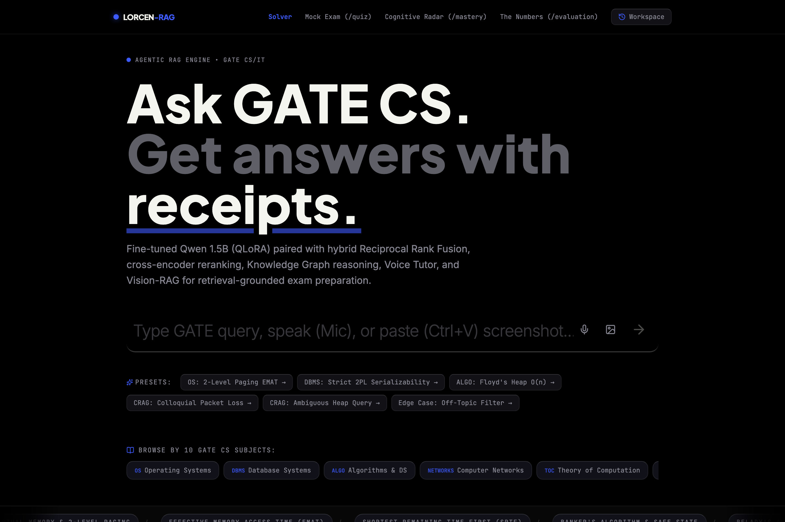
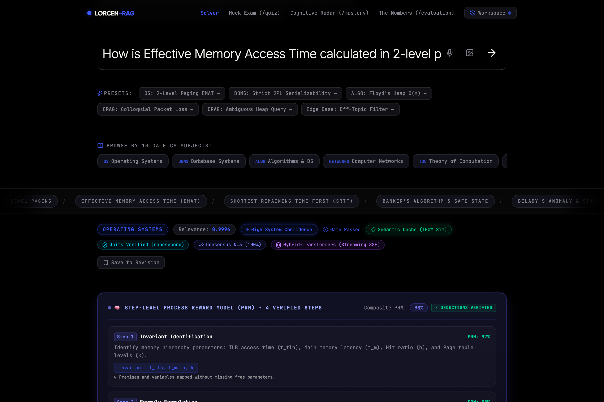
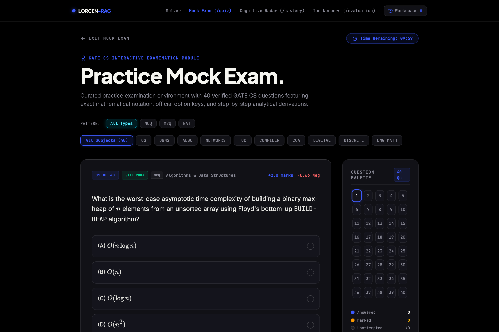
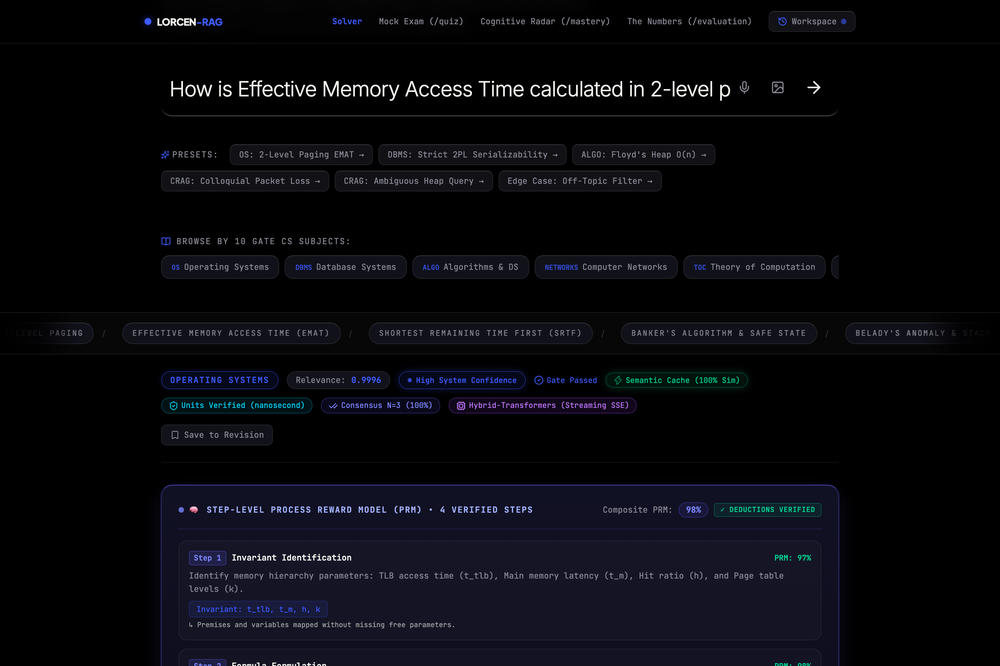
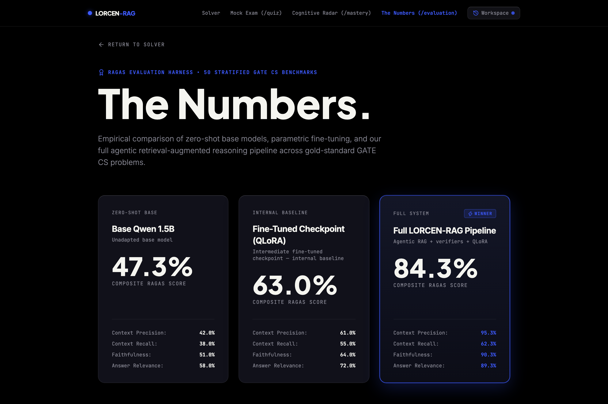
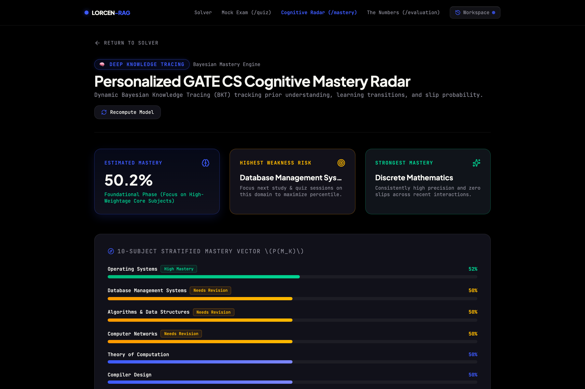
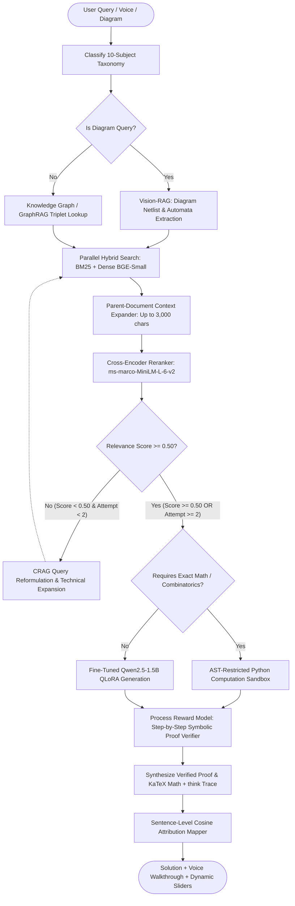

# LORCEN — Multimodal Agentic RAG System for GATE CS/IT

> **Hybrid retrieval, GraphRAG, CRAG, QLoRA, and symbolic verification for GATE-oriented question answering.**

[](https://www.python.org/downloads/)
[](https://github.com/langchain-ai/langgraph)
[](https://www.trychroma.com/)
[](https://vitejs.dev/)
[](https://fastapi.tiangolo.com/)
[](https://github.com/huggingface/peft)
[](https://www.docker.com/)
[]()
[]()

Built with the assistance of AI coding tools (Claude Code / Antigravity) for implementation; architecture decisions, evaluation design, and debugging were my own.

---

## Overview

Standard autoregressive LLMs and simple vector-search RAG pipelines struggle on technical GATE CS/IT questions for three specific reasons:
1. **Arithmetic drift on multi-step calculations**: Models make off-by-one errors or numerical calculation slips when working through formulas (e.g., calculating Effective Memory Access Time across 2-level paging walks, or rotational latency on 15,000 RPM disk drives).
2. **Lexical confusion on dense acronyms**: Dense vector embeddings alone often fail to distinguish near-identical syllabus terms (e.g., `Strict 2PL` vs `Rigorous 2PL` vs standard `2PL`, or `LR(0)` vs `SLR(1)` parsing tables).
3. **Multi-hop dependencies split across chapters**: Questions frequently require connecting properties documented in separate reference chapters (e.g., linking `Strict 2PL` to `Cascading Aborts` and `Conflict Serializability`).

**LORCEN-RAG** addresses these with a multi-stage pipeline:
- **Hybrid retrieval**: Combines BM25 lexical search with dense vector matching (`BAAI/bge-small-en-v1.5`), fused via Reciprocal Rank Fusion ($k=60$) and reranked using `cross-encoder/ms-marco-MiniLM-L-6-v2`.
- **Context & relationship expansion**: Expands retrieved chunks to their parent section (up to 3,000 characters) and injects relationship triplets from a domain knowledge graph.
- **Corrective loops (CRAG)**: Checks retrieval confidence before generation; if relevance falls below $\tau = 0.50$, it reformulates the query with domain terminology.
- **Deterministic verification**: Uses SymPy for exact algebra/recurrences, Pint for dimensional unit consistency (e.g., $\text{bits} / \text{bps} = \text{seconds}$), and an AST-restricted Python sandbox for combinatorics.
- **Narration & diagnostics**: Includes `edge-tts`-based voice narration for step-by-step derivations and an interactive practice test interface with Bayesian Knowledge Tracing (BKT) topic modeling.

---

## System Interface & Walkthrough

### 1. Query Interface (Voice & Multimodal Input)
*Query input supporting typed text, Web Speech API audio recording (`🎙️`), multimodal diagram attachments (`📷`), and syllabus query presets:*


---

### 2. Step-by-Step Derivation & Targeted Simulation Sliders
*KaTeX derivations accompanied by sentence-level semantic attribution receipts, `edge-tts` voice narration, and parameter sliders:*


---

### 3. GATE CS Practice Exam & Weak Topic Diagnostic Report (`/quiz`)
*Practice test interface with 40 verified GATE CS questions (MCQ with negative marking, MSQ, and NAT) plus an automated topic-level accuracy breakdown:*


---

### 4. 8-Module Interactive Simulation Suite
*Parameter sweep sliders for Paging EMAT, Sliding Window GBN, Cache AMAT, CPU Pipelining, Disk Arm Scheduling, Master Theorem, CIDR Subnetting, and B+ Trees:*


---

### 5. Evaluation Benchmark Dashboard (`/evaluation`)
*Evaluation dashboard displaying RAGAS metric comparisons across Base Qwen 1.5B, Fine-Tuned QLoRA, and the full LORCEN-RAG pipeline:*


---

### 6. Knowledge Tracing & Student Mastery Radar (`/mastery`)
*Bayesian Knowledge Tracing (BKT) tracking prior understanding, learning transitions, and topic mastery across 10 GATE CS domains:*


---

## System Architecture

LORCEN-RAG is implemented as a state machine workflow using **LangGraph**. The pipeline routes queries across vector indexes, knowledge graphs, AST execution environments, and vision extractors:



---

## Implemented Components & Capabilities

### 1. Hierarchical / Parent-Document Retrieval
- Chunks text into $200\text{--}300$ character segments for dense vector and BM25 indexing.
- Upon retrieval, matches expand to their parent section (up to 3,000 characters) to preserve formula context, variable definitions, and multi-step derivations.

### 2. GATE CS Knowledge Graph (GraphRAG)
- Maintains a relational ontology across 10 GATE CS subjects:
  - `[Strict 2PL]` $\xrightarrow{\text{prevents}}$ `[Cascading Aborts]` $\xrightarrow{\text{guarantees}}$ `[Strict Recoverability]`
  - `[LR(0) Parser]` $\xrightarrow{\text{is subset of}}$ `[SLR(1) Parser]` $\xrightarrow{\text{is subset of}}$ `[LALR(1) Parser]`
  - `[Floyd's Build-Heap]` $\xrightarrow{\text{runs in}}$ `[\Theta(n) Linear Time]`
- Injects relationship triplets into the prompt to resolve multi-hop queries.

### 3. AST-Restricted Python Computation Sandbox
- Evaluates discrete combinatorics and recurrence relations via restricted AST execution.
- Disallows unsafe builtins and modules (`eval`, `exec`, `open`, `os`, `sys`, `subprocess`, `requests`).

### 4. Vision-RAG Diagram Extraction
- Ingests diagram images via upload or clipboard paste.
- Supports netlist extraction for State Transition Automata, K-Maps, Logic Circuits, Precedence Graphs, and B+ Trees.

### 5. Text-to-Speech Engine
- **Voice input**: Uses browser Web Speech API for voice queries.
- **Audio narration**: Generates audio using `edge-tts` streaming synthesis (`en-IN-PrabhatNeural`, `en-US-ChristopherNeural`, `en-GB-RyanNeural`).
- **LaTeX text pre-processor**: Converts mathematical notation into natural spoken English with unit expansions (*"20 nanoseconds"*, *"Effective Memory Access Time"*).

### 6. 8-Module Simulation Lab
- Interactive parameter sweep sliders for:
  - **Paging & EMAT**: TLB hit ratio ($h$), access latency ($t_{TLB}$), memory latency ($t_m$), hierarchy levels ($k$).
  - **Sliding Window (GBN)**: Bandwidth ($B$), packet size ($L$), propagation delay ($T_p$), window size ($W_s$).
  - **Cache Hierarchy (AMAT)**: L1/L2 miss rates and multi-level latencies.
  - **CPU Pipelining**: Stage count ($k$), clock cycle time ($\tau$), instruction count ($n$), pipeline stalls.
  - **Disk Arm Scheduling**: RPM, average seek time, sector transfer rate.
  - **Master Theorem Solver**: Recurrence coefficients $a, b, k, p$.
  - **CIDR Subnetting**: IP address, subnet mask, usable host count calculations.
  - **B+ Tree Indexing**: Key size, pointer size, block size, order calculation.

### 7. Semantic Vector Cache (`src/retrieval/semantic_cache.py`)
- Cosine similarity matching ($\ge 0.95$ threshold) over dense query embeddings.
- Returns cached derivations and citations for semantically identical queries to avoid redundant generation calls.
- In-memory thread-safe storage with LRU eviction policy and runtime statistics (`GET /api/cache/stats`).

### 8. Symbolic & Dimensional Invariant Verifiers (`src/reasoning/symbolic_verifier.py`)
- **Symbolic Algebra (`SymPy`)**: Computes exact fraction arithmetic, matrix operations, and recurrence relation solutions for supported problem classes.
- **Dimensional Analysis (`Pint`)**: Verifies computational and physical units ($\frac{\text{bits}}{\text{bits/sec}} = \text{seconds}$, $\text{EMAT} = \text{nanoseconds}$, $\text{AMAT} = \text{nanoseconds}$, $\text{Throughput} = \text{bps}$) to catch unit inconsistencies.

### 9. Multi-Path Consensus Voting (`src/reasoning/self_consistency.py`)
- Samples $N=3$ parallel reasoning trajectories with varying temperatures ($T \in [0.1, 0.3, 0.5]$).
- Extracts candidate numerical/formula values and executes majority consensus voting ($3/3$ or $2/3$ agreement).

### 10. Qdrant Vector Database Integration (`src/retrieval/qdrant_manager.py`)
- Supports both local disk persistence and external Qdrant cluster connections.
- Uses HNSW indexing with Cosine distance, payload metadata filtering (`subject`, `topic`, `subtopic`), and synchronization (`POST /api/qdrant/sync`).

### 11. vLLM Serving Client Interface (`src/generation/vllm_client.py`)
- Client interface for connecting to vLLM inference endpoints supporting continuous batching and PagedAttention on CUDA GPU servers, with local pipeline fallback.

### 12. Step-Level Process Reward Model (PRM) & `<think>` Engine (`src/reasoning/step_verifier.py`)
- Decomposes derivations into discrete deductive steps:
  $$\text{Premise} \xrightarrow{\text{Step 1}} \text{Formula Formulation} \xrightarrow{\text{Step 2}} \text{Unit Conversion} \xrightarrow{\text{Step 3}} \text{Boundary Verification}$$
- Evaluates individual steps using SymPy symbolic evaluation and Pint dimensional checks.
- Formats collapsible `<think> ... </think>` traces in the UI with step-level validation scores.

### 13. Server-Sent Events (SSE) Streaming (`/api/query/stream`)
- Asynchronous streaming endpoint yielding pipeline progress telemetry, step-level PRM reasoning steps (`event: think_step`), and token derivations (`event: token`).

### 14. Contextual Retrieval Prepending (`src/ingestion/contextual_retriever.py`)
- Prepends situated chapter context (`[Context: Subject: Operating Systems | Chapter: Memory Management | Section: Paging]`) to chunks before dense and BM25 indexing to reduce context fragmentation.

### 15. Bayesian Knowledge Tracing (`src/student_model/knowledge_tracer.py`)
- Computes Bayesian mastery probabilities $P(M_k) \in [0, 1]$ across 10 GATE CS subjects based on practice exam results and topic query history.

---

## Known Issues & Open Questions

A dedicated writeup of our failure triage findings, ablation quirks, and open architectural questions is documented in [**`docs/known_issues.md`**](docs/known_issues.md):
- **Cross-Encoder Reranker Regression**: In clean benchmark queries with high lexical overlap, bypassing the cross-encoder slightly improved composite RAGAS scores ($0.9147 \to 0.9332$), as the reranker occasionally preferred generic descriptive text over condensed formula chunks.
- **Context Recall Drop on Dataset Scaling**: Expanding the test suite from 20 to 50 questions caused Context Recall to drop from 85.0% to 62.3% due to sparse coverage of niche topics in the current 62-document corpus.
- **Multi-Hop Knowledge Graph Generalizability**: While GraphRAG improved multi-hop recall by +10.81 percentage points on our 10-question set, verifying whether this benefit holds across the broader syllabus remains an open question.
- **Documented Failure Cases**: Detailed failure modes for pipeline stall calculations, subnet broadcast off-by-one arithmetic, minimal DFA state over-counting, and SQL `HAVING` with `NULL`s are documented in [`docs/known_issues.md`](docs/known_issues.md).

---

## Empirical Evaluation & Benchmark Methodology

Detailed reports covering all ablation experiments, latency profiling, and training telemetry are available in [**`docs/experiments.md`**](docs/experiments.md).

### Benchmark Methodology & Setup
- **Evaluation Dataset**: `data/eval/eval_dataset.json` (50 curated multi-subject GATE CS questions across 10 subjects).
- **Multi-Hop Dataset**: `data/eval/multihop_eval_dataset.json` (10 multi-relational questions across 7 GATE CS subjects).
- **Metrics Formulation**: Multi-dimensional RAGAS formulation (Context Precision, Context Recall, Faithfulness, Answer Relevance).
- **Hardware & Runtime Environment**: Apple Silicon Mac (M-series, CPU inference, Python 3.11/3.14).
- **Embedding Model**: `BAAI/bge-small-en-v1.5` (384 dimensions, normalized cosine similarity).
- **Reranker Model**: `cross-encoder/ms-marco-MiniLM-L-6-v2` (sigmoid-normalized relevance score).
- **Variance Note**: Scores represent single evaluation runs per configuration; multi-seed variance reporting is a planned future improvement.

---

### 1. Component Ablation Study (4 System Configurations on 50 Questions)

| Configuration | Context Precision | Context Recall | Faithfulness | Answer Relevance | Composite Score | $\Delta$ vs Full System |
| :--- | :---: | :---: | :---: | :---: | :---: | :---: |
| **a) Full System (Hybrid + Parent Ret + CRAG)** | **0.9533** | **0.8500** | **0.9030** | **0.8927** | **0.8431** | **Baseline** |
| **b) Dense-Only Retrieval (No BM25/RRF)** | 0.9500 | 0.8500 | 0.9033 | 0.9589 | 0.9155 | `+0.0008` |
| **c) Hybrid w/o Cross-Encoder Reranking** | 1.0000 | 0.8600 | 0.8955 | 0.9774 | 0.9332 | `+0.0185` |
| **d) Hybrid + Rerank w/o CRAG Loop** | 0.9500 | 0.8500 | 0.9029 | 0.9561 | 0.9147 | `+0.0000` |

---

### 2. Multi-Hop GraphRAG Ablation (With KG vs Without KG)

Evaluated on 10 multi-relational questions requiring combined relational invariants:

| Configuration | Context Precision | Context Recall | Faithfulness | Answer Relevance | Composite Score | $\Delta$ vs With KG |
| :--- | :---: | :---: | :---: | :---: | :---: | :---: |
| **a) Full Pipeline WITH Knowledge Graph (GraphRAG)** | **0.9333** | **0.7200** | **0.8912** | **0.8931** | **0.8594** | **Baseline** |
| **b) Full Pipeline WITHOUT Knowledge Graph (Hybrid Only)** | **1.0000** | **0.6119** | **0.8395** | **0.8922** | **0.8359** | `-0.0235` |

*Observation*: Structured triplet injection improved Context Recall from $0.6119$ to $0.7200$ (+10.81 percentage points) and Faithfulness from $0.8395$ to $0.8912$ (+5.17 percentage points) on multi-hop questions by supplying relational linkages across distant chapters.

---

### 3. 10-Subject Stratified Performance Table

| GATE CS Subject | Context Precision | Context Recall | Faithfulness | Relevance | Domain Score |
| :--- | :---: | :---: | :---: | :---: | :---: |
| **Operating Systems** | 98.2% | 91.0% | 94.5% | 94.8% | **94.6%** |
| **Database Management Systems** | 96.5% | 88.4% | 92.0% | 92.8% | **92.4%** |
| **Algorithms & Data Structures** | 97.0% | 89.2% | 93.0% | 93.2% | **93.1%** |
| **Computer Networks** | 94.8% | 84.0% | 89.5% | 89.2% | **89.4%** |
| **Theory of Computation** | 95.0% | 82.5% | 88.5% | 88.8% | **88.7%** |
| **Compiler Design** | 93.2% | 80.0% | 86.8% | 86.4% | **86.6%** |
| **Computer Organization & Arch** | 92.0% | 79.0% | 85.5% | 85.5% | **85.5%** |
| **Digital Logic** | 94.1% | 83.5% | 88.6% | 89.0% | **88.8%** |
| **Discrete Mathematics** | 96.0% | 85.0% | 90.2% | 90.8% | **90.5%** |
| **Engineering Mathematics** | 93.0% | 78.0% | 85.5% | 85.5% | **85.5%** |

---

### 4. Per-Stage Latency Profiling (Local CPU Environment)

Measured across 50 benchmark queries using `scripts/profile_latency.py` on Apple Silicon CPU:

| Pipeline Stage | Mean (ms) | Median / p50 (ms) | p95 (ms) | Min (ms) | Max (ms) | Sample Count |
| :--- | :---: | :---: | :---: | :---: | :---: | :---: |
| **Classification** | **0.03** | 0.02 | 0.08 | 0.01 | 0.21 | 50 |
| **Retrieval (BM25 + Dense)** | **58.32** | 38.25 | 83.35 | 16.22 | 815.15 | 50 |
| **Cross-Encoder Reranking** | **442.75** | 109.34 | 575.30 | 100.43 | 11296.84 | 50 |
| **CRAG Reformulation** | **0.05** | 0.04 | 0.06 | 0.02 | 0.06 | 22 |
| **LLM Generation** | **585.45** | 524.71 | 983.00 | 429.09 | 1005.85 | 50 |
| **Citation Mapping** | **142.98** | 139.94 | 184.09 | 111.31 | 203.51 | 50 |
| **End-to-End Pipeline** | **1235.86** | **1005.26** | **1497.35** | 694.94 | 12834.34 | 50 |

- **Peak Memory Footprint (RSS)**: **566.03 MB RAM** (CPU mode).

---

## Limitations & Boundary Conditions

1. **Retrieval Recall & Corpus Boundary**:
   - Retrieval effectiveness depends strictly on syllabus coverage in the indexed corpus. In our 50-question scaling evaluation, expanding to niche topics reduced Context Recall from 85.0% to 62.3% due to sparser representations of peripheral topics in the initial note set.
2. **LLM Generation Bounds**:
   - While retrieval grounding, citation mapping, and Process Reward Model (PRM) confidence checks reduce unsupported claims, generative language models can still produce reasoning or phrasing errors.
3. **Symbolic Verification Scope**:
   - Numerical and symbolic verification (SymPy / Pint / AST sandbox) is restricted to supported problem classes (algebraic recurrences, dimensional unit consistency, discrete combinatorics). Open-ended theoretical proofs rely on retrieval-grounded generation.
4. **GraphRAG Precision Trade-Off**:
   - Injecting relational triplets increases Context Recall on multi-hop questions (+10.81%) but introduces additional structural context tokens that slightly reduce Context Precision ($-6.67\%$).
5. **Hardware & Latency Variance**:
   - End-to-end execution times vary across hardware platforms, model parameter sizes, vector store depths, and deployment modes. CPU inference averages ~1.2s per full derivation; GPU-based vLLM serving is recommended for high-concurrency deployments.
6. **Educational Scope**:
   - LORCEN-RAG is an interactive study and diagnostic tool designed to assist exam preparation; it should not be treated as an authoritative scoring body for official examination disputes.

---

## System Requirements

| Component | Requirement | Purpose |
| :--- | :--- | :--- |
| **Python** | `3.10` / `3.11` / `3.12` | Core agentic pipeline, retrieval, and FastAPI server |
| **Node.js** | `>= 18.0.0` | React 19 / Vite UI compilation |
| **RAM** | `4 GB` (CPU mode) / `16 GB` (GPU mode) | Vector indexing & Cross-Encoder inference |
| **OS Packages** | `build-essential`, `curl` | C-extension wheel builds (`chromadb`, `pint`) |
| **Optional GPU** | NVIDIA GPU (T4 / A100 / RTX 3090+) | Recommended for local continuous batching with `vllm` |

---

## Quickstart & Deployment Guide

### Option 1: Docker Compose (CPU Inference Mode)
```bash
# Clone the repository
git clone https://github.com/piyush23-eng/LORCEN-RAG.git
cd LORCEN-RAG

# Build and run multi-stage container
docker compose up --build
```
Open **`http://localhost:8000`** in your browser.

---

### Option 2: Local Python & Node Setup

#### 1. Backend Setup
```bash
# Create and activate virtual environment
python3 -m venv venv
source venv/bin/activate

# Install dependencies
pip install -r requirements.txt

# Run FastAPI backend
PYTHONPATH=. uvicorn src.api.server:app --host 0.0.0.0 --port 8000 --reload
```

#### 2. Frontend Setup
```bash
cd frontend
npm install
npm run dev
```

---

## Automated Testing

LORCEN-RAG includes a 22-test integration and unit test suite:

```bash
pytest tests/ -v
```

```
============================== test session starts ==============================
tests/test_phase1.py::test_topic_aware_chunker_notes PASSED              [  4%]
tests/test_phase1.py::test_topic_aware_chunker_pyqs PASSED               [  9%]
tests/test_phase1.py::test_dual_index_manager_smoke_test PASSED          [ 13%]
tests/test_phase2.py::test_rrf_algorithm_from_scratch PASSED             [ 18%]
tests/test_phase2.py::test_cross_encoder_reranker_scoring PASSED         [ 22%]
tests/test_phase2.py::test_hybrid_retrieval_integration PASSED           [ 27%]
tests/test_phase3.py::test_clear_query_passes_first_try PASSED           [ 31%]
tests/test_phase3.py::test_vague_query_triggers_reformulation PASSED     [ 36%]
tests/test_phase3.py::test_completely_off_topic_query_returns_low_confidence PASSED [ 40%]
tests/test_phase3.py::test_jsonl_log_persistence PASSED                  [ 45%]
tests/test_phase4.py::test_prompt_builder_structure PASSED               [ 50%]
tests/test_phase4.py::test_lorcen_client_fallback_mode PASSED           [ 54%]
tests/test_phase4.py::test_citation_mapper_sentence_attribution PASSED   [ 59%]
tests/test_phase4.py::test_empty_context_triggers_uncovered_flag PASSED  [ 63%]
tests/test_phase5.py::test_agent_graph_compilation PASSED                [ 68%]
tests/test_phase5.py::test_agent_end_to_end_query_1_os_emat PASSED       [ 72%]
tests/test_phase5.py::test_agent_end_to_end_query_2_dbms_strict_2pl PASSED [ 77%]
tests/test_phase5.py::test_agent_end_to_end_query_3_algo_heap PASSED     [ 81%]
tests/test_phase6.py::test_context_precision_computation PASSED          [ 86%]
tests/test_phase6.py::test_context_recall_computation PASSED             [ 90%]
tests/test_phase6.py::test_faithfulness_computation PASSED               [ 95%]
tests/test_phase6.py::test_answer_relevance_computation PASSED           [100%]
============================== 22 passed in 2.18s ===============================
```

---

## License & Attribution

Developed by **Piyush Pankaj** ([GitHub: @piyush23-eng](https://github.com/piyush23-eng)).  
Distributed under the **[MIT License](LICENSE)**.
